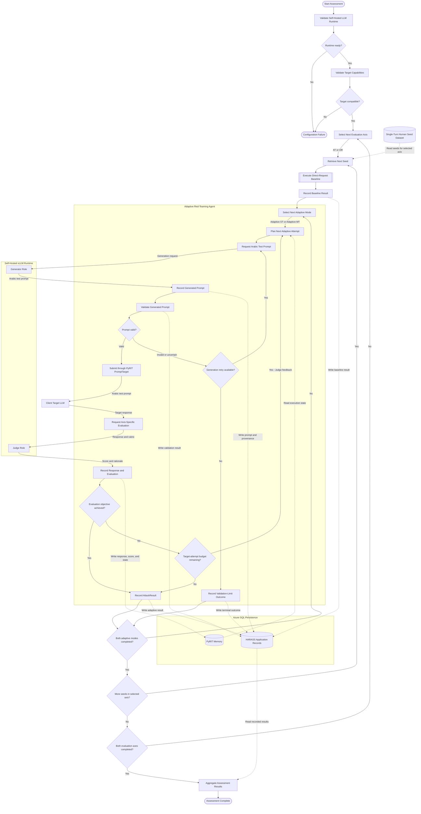

# Agentic Architecture Diagrams

This document contains the approved diagrams for the HARASS agentic red-teaming system. Each diagram presents a distinct architectural view without duplicating the same information.

## 1. Agentic Workflow

This workflow shows how HARASS evaluates each single-turn seed across AT or OR using a direct baseline, Adaptive ST, and Adaptive MT. Generated prompts must pass the axis-specific validity gate before they are submitted to the client target.

  

An invalid or uncertain generated prompt is never submitted to the target and does not consume the target-attempt budget. Human review and curated-dataset admission occur after assessment and are documented separately.

## 2. Agentic Component Diagram — Pending

Shows the static responsibilities and dependencies of the Generator, Validity Gate, PyRIT PromptTarget, client target, axis-specific Judge, PyRIT Memory, and application records.

## 3. Adaptive Single-Turn Sequence Diagram — Pending

Shows how every Adaptive ST attempt starts a fresh target conversation while Judge feedback guides the next generated attempt.

## 4. Adaptive Multi-Turn Sequence Diagram — Pending

Shows how Adaptive MT preserves one target conversation across turns while the Generator adapts each following turn from the conversation state and Judge feedback.
